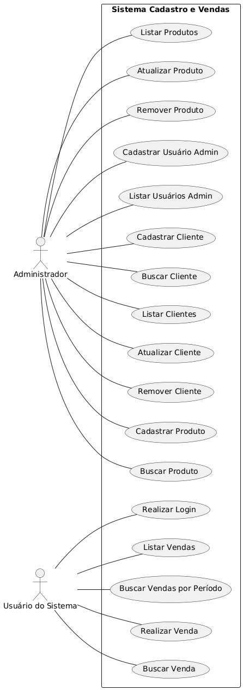
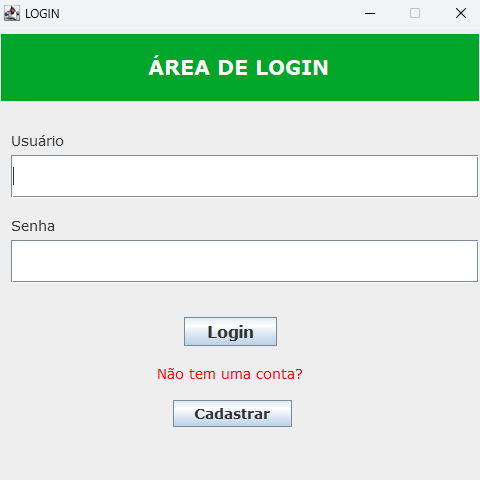
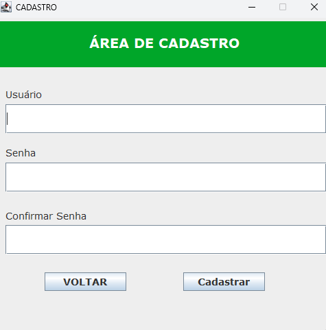
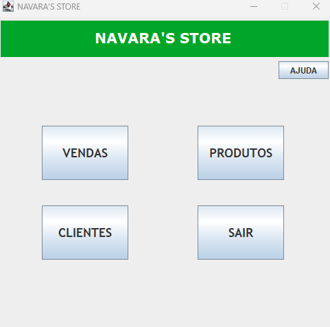
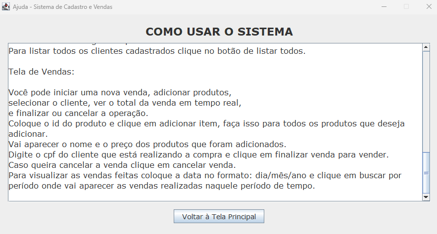
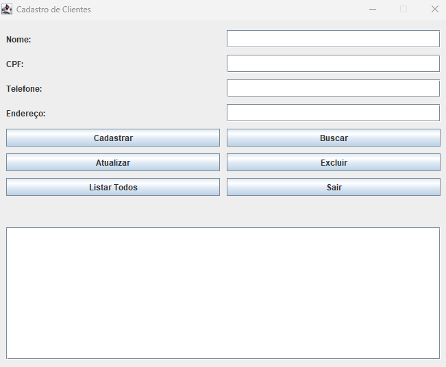
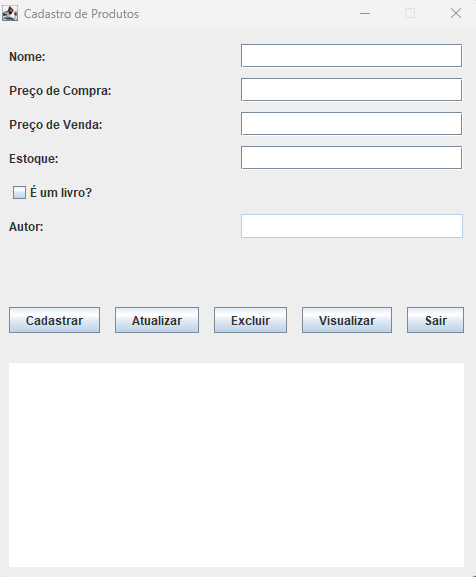
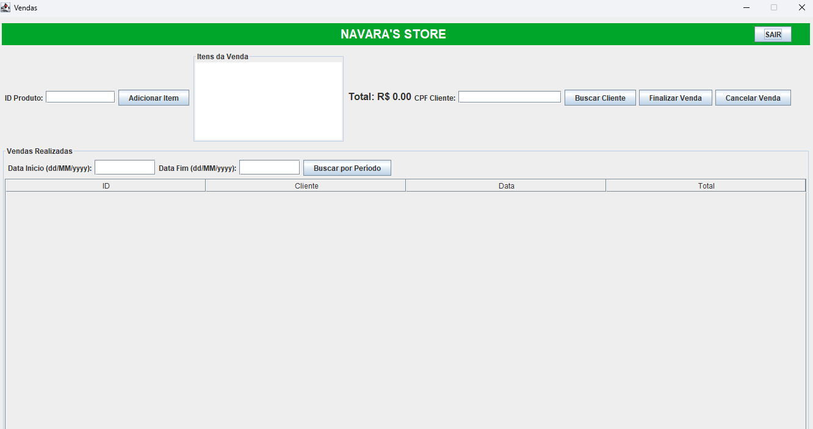

## Visão Geral

Este sistema foi desenvolvido para gerenciar o cadastro de clientes e produtos, além de facilitar o processo de vendas e o acompanhamento das mesmas. Ele oferece uma interface gráfica intuitiva para que usuários possam interagir com as funcionalidades de forma eficiente.

## Funcionalidades

O sistema oferece as seguintes funcionalidades:

**Módulo de Clientes:**

* **Cadastro de Clientes:** Permite registrar novos clientes no sistema, incluindo informações como CPF, nome, telefone e endereço.
* **Busca de Clientes:** Possibilita encontrar clientes cadastrados através do CPF.
* **Listagem de Clientes:** Exibe todos os clientes cadastrados no sistema.
* **Atualização de Clientes:** Permite modificar as informações de um cliente existente.
* **Remoção de Clientes:** Possibilita excluir um cliente do sistema.

**Módulo de Produtos:**

* **Cadastro de Produtos:** Permite registrar novos produtos no sistema, incluindo nome, estoque, autor (opcional), preço de compra, preço de venda e status (ativo/inativo).
* **Busca de Produtos:** Possibilita encontrar produtos cadastrados através do ID.
* **Listagem de Produtos:** Exibe todos os produtos cadastrados no sistema.
* **Atualização de Produtos:** Permite modificar as informações de um produto existente.
* **Remoção de Produtos:** Possibilita excluir um produto do sistema.

**Módulo de Vendas:**

* **Realização de Vendas:** Permite criar novas vendas, adicionando itens (produtos) ao carrinho, associando um cliente à venda e finalizando a transação.
* **Busca de Vendas:** Possibilita encontrar vendas registradas através do ID.
* **Listagem de Vendas:** Exibe todas as vendas realizadas no sistema.
* **Busca de Vendas por Período:** Permite filtrar e exibir as vendas realizadas dentro de um intervalo de datas específico.
* **Cancelamento de Venda:** Permite cancelar uma venda em andamento, removendo todos os itens adicionados.

**Módulo de Usuários Administrativos:**

* **Cadastro de Usuários Administrativos:** Permite registrar novos usuários com permissões de administrador no sistema.
* **Listagem de Usuários Administrativos:** Exibe todos os usuários administradores cadastrados.
* **Login:** Permite que usuários administrativos se autentiquem no sistema para acessar as funcionalidades de gerenciamento.
* **Logout:** Permite que usuários administrativos encerrem sua sessão no sistema.

## Tecnologias Utilizadas

* **Linguagem de Programação:** Java
* **Interface Gráfica:** Swing (Java)
* **Banco de Dados:** MySQL (conforme estrutura SQL fornecida)
* **Driver de Banco de Dados:** JDBC (Java Database Connectivity)

## Pré-requisitos

Para executar este sistema, você precisará ter instalado em sua máquina:

* **Java Development Kit (JDK):** Versão compatível com o projeto.
* **MySQL Server:** O banco de dados onde as informações serão armazenadas.
* **MySQL Workbench (opcional):** Uma ferramenta GUI para gerenciar o MySQL.

## Configuração do Banco de Dados

1.  **Crie o Banco de Dados:** Utilize uma ferramenta de gerenciamento MySQL (como o MySQL Workbench ou a linha de comando) para criar um novo banco de dados chamado `cadastroevendas`.

    ```sql
    CREATE DATABASE cadastroevendas;
    ```

2.  **Selecione o Banco de Dados:** Use o seguinte comando para selecionar o banco de dados criado.

    ```sql
    USE cadastroevendas;
    ```

3.  **Crie as Tabelas:** Execute os scripts SQL fornecidos para criar as tabelas necessárias (`clientes`, `produtos`, `vendas`, `venda_produtos`, `usuarios_admin`).

    ```sql
    -- Script para criar as tabelas (conteúdo do arquivo SQL fornecido)
    CREATE TABLE clientes (
        cpf VARCHAR(11) PRIMARY KEY,
        nome VARCHAR(100) NOT NULL,
        telefone VARCHAR(11) NOT NULL,
        endereco VARCHAR(200) NOT NULL
    );

    CREATE TABLE produtos (
        id INT PRIMARY KEY AUTO_INCREMENT,
        nome VARCHAR(100) NOT NULL,
        estoque INT NOT NULL,
        autor VARCHAR(100),
        preco_compra DECIMAL(10, 2) NOT NULL,
        preco_venda DECIMAL(10, 2) NOT NULL,
        ativo TINYINT(1) DEFAULT 1
    );

    CREATE TABLE vendas (
        id INT AUTO_INCREMENT PRIMARY KEY,
        cpf_cliente VARCHAR(11),
        data_venda DATE NOT NULL,
        FOREIGN KEY (cpf_cliente) REFERENCES clientes(cpf)
    );

    CREATE TABLE venda_produtos (
        id_venda INT,
        id_produto INT,
        quantidade INT NOT NULL DEFAULT 1,
        FOREIGN KEY (id_venda) REFERENCES vendas(id),
        FOREIGN KEY (id_produto) REFERENCES produtos(id),
        PRIMARY KEY (id_venda, id_produto)
    );

    CREATE TABLE usuarios_admin (
        id INT AUTO_INCREMENT PRIMARY KEY,
        usuario VARCHAR(50) NOT NULL UNIQUE,
        senha VARCHAR(255) NOT NULL
    );
    ```

4.  **Configuração da Conexão:** Certifique-se de ter o arquivo necessário para fazer a conexão do java com o banco de dados disponível para donwload em <a href="https://dev.mysql.com/downloads/connector/j/">https://dev.mysql.com/downloads/connector/j/</a>. Verifique também se as configurações de conexão com o banco de dados (host, porta, nome do banco de dados, usuário e senha do MySQL) estejam corretamente definidas no código Java do sistema, e que o servidor do banco de dados esteja em execução. As informações de conexão com o banco de dados estão no arquivo db.properties com o código:
   ````
    dburl=jdbc:mysql://localhost:3306/cadastroevendas?useSSL=false&allowPublicKeyRetrieval=true
    user=gabriel
    password=123456
   ````
Caso tenha outro usuário e senha configurados no banco de dados basta modificar os campos em db.properties


## Como Executar o Sistema

1.  **Compile o Código Java:** Utilize um compilador Java (como o `javac` do JDK) para compilar todos os arquivos `.java` do projeto.

    ```bash
    javac src/app/Main.java src/view/*.java src/controller/*.java src/model/*.java
    ```

    (Este comando pode variar dependendo da estrutura do seu projeto e se você está usando um ambiente de desenvolvimento integrado - IDE).

2.  **Execute a Aplicação:** Execute a classe principal (`Main`) para iniciar o sistema.

    ```bash
    java app.Main
    ```

    (Certifique-se de estar no diretório raiz do projeto ou que o classpath esteja configurado corretamente).

3.  **Interface Gráfica:** A interface de login do sistema deverá ser exibida, permitindo que um usuário administrativo faça login para acessar as funcionalidades do sistema.

## Estrutura do Projeto (Exemplo)

SistemaCadastroVendas/<br>
├── src/<br>
│   ├── app/<br>
│   │   └── Main.java<br>
│   ├── controller/<br>
│   │   ├── ClienteController.java<br>
│   │   ├── ProdutoController.java<br>
│   │   ├── VendaController.java<br>
│   │   └── UsuarioAdminController.java<br>
│   ├── model/<br>
│   │   ├── Cliente.java<br>
│   │   ├── Produto.java<br>
│   │   ├── Venda.java<br>
│   │   └── UsuarioAdmin.java<br>
│   └── view/<br>
│       ├── ClientesView.java<br>
│       ├── LoginView.java<br>
│       ├── ProdutosView.java<br>
│       ├── TelaPrincipalView.java<br>
│       ├── UsuariosAdminView.java<br>
│       └── VendasView.java<br>
├── images/<br>
│   ├── logo.png<br>
│   ├── user_icon.png<br>
│   └── product_placeholder.png<br>
├── README.md<br>
└── (outros arquivos de configuração, etc.)<br>

## Diagrama de classes

O diagrama de classes representa a estrutura estática do sistema, mostrando as classes, seus atributos e os relacionamentos entre elas. Ele oferece uma visão do design do software em termos de suas entidades e como elas se conectam.

**Classes do Modelo (`model` package):**

* **`Cliente`:** Representa um cliente do sistema.
    * **Atributos:** `cpf` (String, chave primária), `nome` (String), `telefone` (String), `endereco` (String).
    * **Responsabilidade:** Armazenar informações sobre os clientes.

* **`Produto`:** Representa um produto disponível para venda.
    * **Atributos:** `id` (int, chave primária, auto_increment), `nome` (String), `estoque` (int), `autor` (String, opcional), `precoCompra` (double), `precoVenda` (double), `ativo` (boolean).
    * **Responsabilidade:** Armazenar informações sobre os produtos, incluindo detalhes de estoque e preços.

* **`Venda`:** Representa uma transação de venda realizada.
    * **Atributos:** `id` (int, chave primária, auto_increment), `cliente` (Cliente), `dataVenda` (LocalDate), `produtos` (List\<Produto\>).
    * **Responsabilidade:** Armazenar informações sobre uma venda, incluindo o cliente, a data e os produtos vendidos. Possui um método para calcular o total da venda.

* **`UsuarioAdmin`:** Representa um usuário com privilégios administrativos no sistema.
    * **Atributos:** `id` (int, chave primária, auto_increment), `usuario` (String), `senha` (String).
    * **Responsabilidade:** Armazenar informações de login para administradores do sistema.

**Classes de Controle (`controller` package):**

* **`ClienteController`:** Responsável pela lógica de negócios relacionada aos clientes.
    * **Métodos:** `cadastrarCliente()`, `buscarCliente()`, `listarClientes()`, `atualizarCliente()`, `removerCliente()`.
    * **Responsabilidade:** Mediar a interação entre a camada de visualização (`view`) e o modelo (`model`) para as operações de cliente.

* **`ProdutoController`:** Responsável pela lógica de negócios relacionada aos produtos.
    * **Métodos:** `cadastrarProduto()`, `buscarProduto()`, `listarProdutos()`, `atualizarProduto()`, `removerProduto()`.
    * **Responsabilidade:** Mediar a interação entre a camada de visualização e o modelo para as operações de produto.

* **`VendaController`:** Responsável pela lógica de negócios relacionada às vendas.
    * **Métodos:** `realizarVenda()`, `buscarVenda()`, `listarVendas()`, `listarVendasPorPeriodo()`.
    * **Responsabilidade:** Mediar a interação entre a camada de visualização e o modelo para as operações de venda.

* **`UsuarioAdminController`:** Responsável pela lógica de negócios relacionada aos usuários administrativos.
    * **Métodos:** `cadastrarUsuario()`, `buscarUsuario()`, `autenticarUsuario()`.
    * **Responsabilidade:** Mediar a interação entre a camada de visualização (especialmente `LoginView`) e o modelo para as operações de usuário administrativo, incluindo a autenticação.

**Classes de Visualização (`view` package):**

* **`LoginView`:** Interface para o usuário administrativo fazer login no sistema.
* **`TelaPrincipalView`:** Tela principal exibida após o login, servindo como ponto de acesso para as outras funcionalidades.
* **`ClientesView`:** Interface para gerenciar clientes (cadastrar, buscar, listar, atualizar, remover).
* **`ProdutosView`:** Interface para gerenciar produtos (cadastrar, buscar, listar, atualizar, remover).
* **`VendasView`:** Interface para realizar vendas, buscar e listar vendas.
* **`UsuariosAdminView`:** Interface para gerenciar usuários administrativos (cadastrar, listar).

**Relacionamentos:**

* Uma `Venda` pode conter múltiplos `Produto`s (relação de agregação/composição, dependendo da implementação).
* Uma `Venda` está associada a um `Cliente` (quem realizou a compra).
* As classes de controle interagem com as classes do modelo para acessar e manipular os dados.
* As classes de visualização interagem com as classes de controle para executar as ações do usuário e exibir os resultados.
* A classe `Main` (na pasta `app`) inicia a aplicação, geralmente instanciando a `LoginView`.

## Diagrama de Casos de Uso


O diagrama de casos de uso ilustra as interações entre os atores (usuários do sistema) e o sistema, mostrando as funcionalidades que o sistema oferece do ponto de vista do usuário.

**Atores:**

* **Administrador:** Representa um usuário com acesso a todas as funcionalidades de gerenciamento do sistema.
* **Usuário do Sistema:** Representa um usuário que interage com o sistema para realizar vendas e consultar informações relacionadas a vendas (presumivelmente um vendedor).

**Casos de Uso (Funcionalidades do Sistema):**

* **Realizar Login:** Permite que o Administrador acesse o sistema.
* **Cadastrar Cliente:** Permite ao Administrador adicionar novos clientes.
* **Buscar Cliente:** Permite ao Administrador encontrar clientes existentes.
* **Listar Clientes:** Permite ao Administrador visualizar todos os clientes.
* **Atualizar Cliente:** Permite ao Administrador modificar informações de clientes.
* **Remover Cliente:** Permite ao Administrador excluir clientes.
* **Cadastrar Produto:** Permite ao Administrador adicionar novos produtos.
* **Buscar Produto:** Permite ao Administrador encontrar produtos existentes.
* **Listar Produtos:** Permite ao Administrador visualizar todos os produtos.
* **Atualizar Produto:** Permite ao Administrador modificar informações de produtos.
* **Remover Produto:** Permite ao Administrador excluir produtos.
* **Realizar Venda:** Permite ao Usuário do Sistema registrar uma nova venda.
* **Buscar Venda:** Permite ao Usuário do Sistema encontrar vendas existentes.
* **Listar Vendas:** Permite ao Usuário do Sistema visualizar todas as vendas.
* **Buscar Vendas por Período:** Permite ao Usuário do Sistema filtrar vendas por um intervalo de datas.
* **Cadastrar Usuário Admin:** Permite ao Administrador criar novas contas de administrador.
* **Listar Usuários Admin:** Permite ao Administrador visualizar a lista de usuários administradores.

**Relacionamentos:**

* Os atores (`Administrador` e `Usuário do Sistema`) estão associados aos casos de uso que eles podem iniciar ou com os quais interagem.
* O Administrador geralmente tem acesso a todos os casos de uso relacionados ao gerenciamento (clientes, produtos, usuários).
* O Usuário do Sistema tem acesso aos casos de uso relacionados ao processo de vendas.

Em resumo, o **diagrama de classes** foca na estrutura interna do sistema, mostrando as entidades e seus relacionamentos, enquanto o **diagrama de casos de uso** foca na interação externa, mostrando o que o sistema faz do ponto de vista dos usuários. Ambos os diagramas são importantes para entender e projetar um sistema de software.

## Imagens do Projeto









## Contribuição

Contribuições para este projeto são bem-vindas. Sinta-se à vontade para abrir issues relatando bugs ou sugerindo novas funcionalidades, e enviar pull requests com suas implementações.

## Autor

[Gabriel Rodrigues dos Santos]
